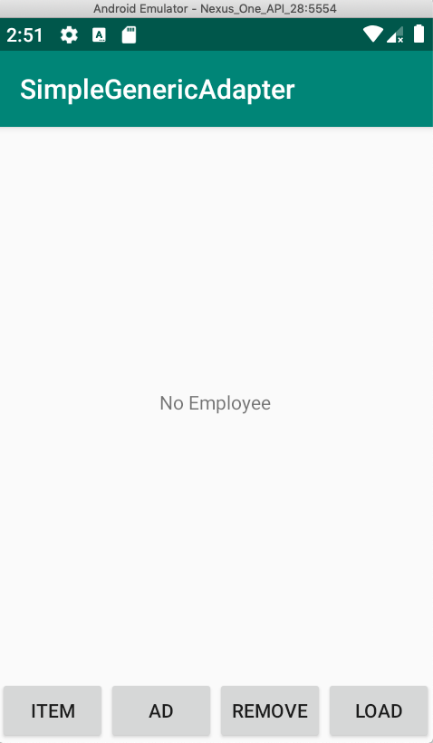
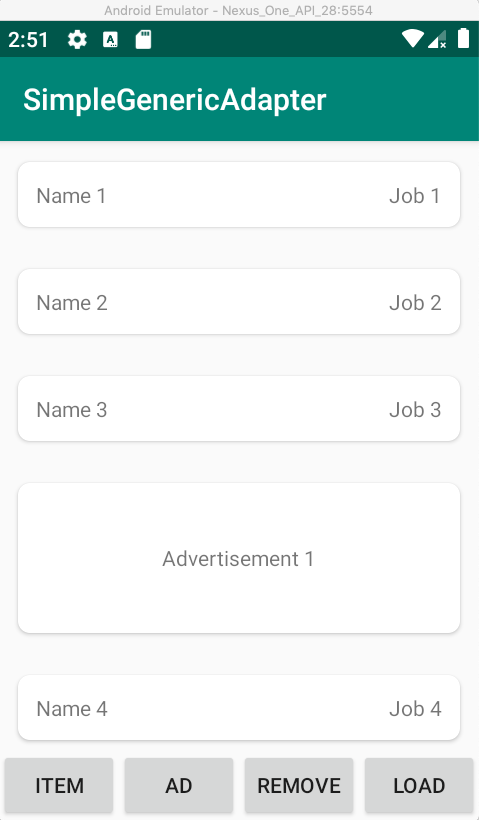
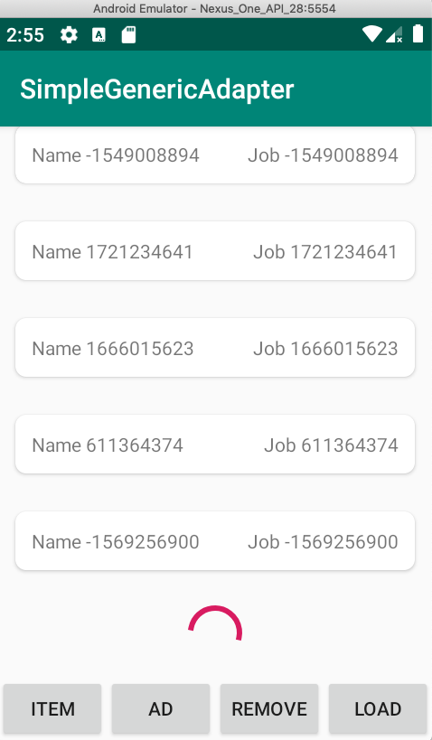
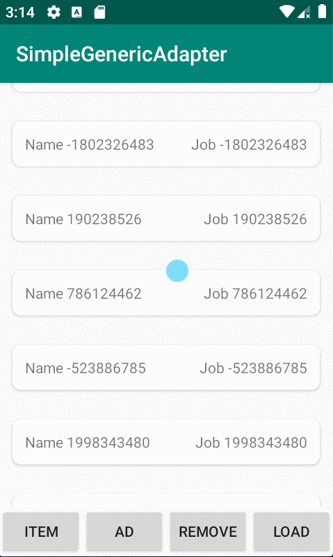
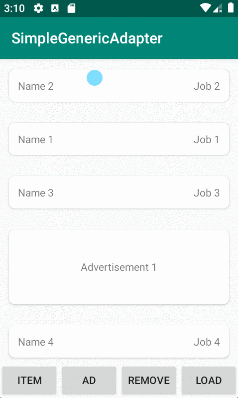
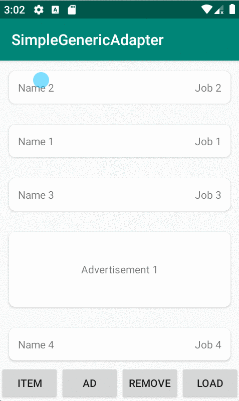
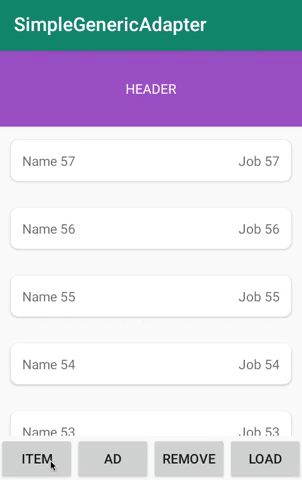

# SimpleGenericAdapter


SimpleGenericAdapter is an Android library that helps developers to easily create a Recyclerview Adapter without repeatedly building any adapter boilerplate.

---

## Features

### v0.3.0

- Support Sticky Header
- Support Sticky Items
- Fix bugs

### v0.2.0

- Support Scroll Item Animation
- Add Drag & Drop feature

### v0.1.0

- Create UI Module to bind item data
- Create UI Module for Empty state
- Create UI Module for Paging
- Support OnItemClickListener

---

## Demo

  

---

## How to use it?

### Setup

On your module's `build.gradle` file add this implementation statement to the `dependencies` section:

```groovy
dependencies {
  implementation 'com.github.trieulh-ict:SimpleGenericAdapter:x.x.x'
}
```

Also make sure that Project module includes `jitpack`:

```groovy
allprojects {
    repositories {
        ...
        maven { url 'https://jitpack.io' }
    }
}
```

### Create Modules

- Implement an Item Module using `ItemModule<ModelType>` (`ModelType` class should implement `Diffable`)

```kotlin
class AdvertisementModule : ItemModule<Advertisement>() {
    override val layoutRes: Int = R.layout.item_ad

    override fun getType(): Int = ItemType.ADVERTISEMENT.value

    override fun isStickyModule(item: Advertisement): Boolean = true

    override fun onBind(item: Advertisement, holder: SimpleViewHolder) {
            holder.itemView.findViewById<AppCompatTextView>(R.id.text_content).text = item.content
    }

    override fun isModule(item: Diffable): Boolean {
        return item is Advertisement
    }
}
```

- Implement an Empty Module using

```kotlin
class EmployeeEmptyModule : EmptyModule() {

    override val layoutRes: Int = R.layout.item_no_employee

    override fun onBind(holder: SimpleViewHolder) {
        //Do nothing now
    }
}
```

- Create adapter and attach to your reyclerview:

```kotlin
adapter = SimpleGenericAdapter.Builder()
            .addItemModule(AdvertisementModule())
            .addEmptyModule(EmployeeEmptyModule())
            .attachTo(listView)
```

- You can create Paging module by defining a class or using anonymous object:

```kotlin
adapter = SimpleGenericAdapter.Builder()
            ...
            .addPagingModule(object : PagingModule() {
                            override fun withVisibleThreshold(): Int = 3
                            override val layoutRes: Int = R.layout.item_loading_employee
                            override fun onLoadMore(currentPage: Int) {
                                //Load new Data and add to adapter using `adapter.setItems()`
                            }

                            override fun onBind(holder: SimpleViewHolder) {
                                //Do nothing now
                            }
                        })
            .attachTo(listView)
```

- Currently the library only support OnItemClickerListener:

```kotlin
adapter = SimpleGenericAdapter.Builder()
            ...
            .addItemModule(EmployeeModule().addOnItemSelectedListener(object : OnItemSelectedListener<Employee> {
                            override fun onItemSelected(position: Int, item: Employee) {
                                Toast.makeText(this@MainActivity, "${item.id}", Toast.LENGTH_SHORT).show()
                            }
                        }))
            .attachTo(listView)
```

### Scroll Animation

- Now support 4 default animations `ALPHA_IN`, `SCALE_IN`, `SLIDE_IN_BOTTOM` and `SLIDE_IN_RIGHT`:



```kotlin
adapter = SimpleGenericAdapter.Builder()
            ...
            .addItemAnimation(SimpleAnimationType.SLIDE_IN_RIGHT)
            ...
            .attachTo(listView)
```

- Or you can create and add your own custom animation xml:

```kotlin
adapter = SimpleGenericAdapter.Builder()
            ...
            .addItemAnimation(R.anim.slide_right)
            ...
            .attachTo(listView)
```

### Drag and Drop Item

- Activate Drag and Drop by setting mode `FULL`, `PARTIAL`, `NONE`:

```kotlin
adapter = SimpleGenericAdapter.Builder()
            ...
            .setDragAndDropMode(SimpleDragAndDropMode.FULL)
            ...
            .attachTo(listView)
```

- `FULL` means you can long press the whole item to drag and drop:



- `PARTIAL` means you can choose which view part of ViewHolder to handle Dragging



- To enable it, set mode to `PARTIAL`:

```kotlin
adapter = SimpleGenericAdapter.Builder()
            ...
            .setDragAndDropMode(SimpleDragAndDropMode.PARTIAL)
            ...
            .attachTo(listView)
```

- In ItemModule, Set view part:

```kotlin
    override fun onBind(item: Employee, holder: SimpleViewHolder) {
        ...
        holder.setDragAndDropByView(view)
        ...
    }
```

### Add Sticky/Non-sticky Header



- To use Header, you can implement `HeaderModule` class:

```kotlin
class HeaderEmployeeModule(private var isSticky: Boolean = false) : HeaderModule() {
    override val layoutRes: Int = R.layout.item_header

    override fun onBind(holder: SimpleViewHolder) {
        //Do nothing now
    }

    override fun isStickyModule(): Boolean = isSticky
}
```

- You can set header as sticky item by overriding `isStickyModule()` method

### Create Sticky/Non-sticky Item

- To set normal item as Sticky one, you can implement `ItemModule` class as usual, then override method `isStickyModule()` to `true`:

```kotlin
class AdvertisementModule : ItemModule<Advertisement>() {
    ...
    override fun isStickyModule(item: Advertisement): Boolean = true
    ...
}
```

---

## In the future

The library is still under development,so you can suggest more feature by committing issues to this repository.

---

## Credit

This library is based on OneAdapter of ironSource. You can check their library [here](https://github.com/ironSource/OneAdapter)
Also big thanks to Saber Solooki's [ariticle](https://medium.com/@saber.solooki/sticky-header-for-recyclerview-c0eb551c3f68) for the idea and implementation of Sticky header.

---

## License

MIT License

Copyright (c) 2019 Tristan Le

Permission is hereby granted, free of charge, to any person obtaining a copy
of this software and associated documentation files (the "Software"), to deal
in the Software without restriction, including without limitation the rights
to use, copy, modify, merge, publish, distribute, sublicense, and/or sell
copies of the Software, and to permit persons to whom the Software is
furnished to do so, subject to the following conditions:

The above copyright notice and this permission notice shall be included in all
copies or substantial portions of the Software.

THE SOFTWARE IS PROVIDED "AS IS", WITHOUT WARRANTY OF ANY KIND, EXPRESS OR
IMPLIED, INCLUDING BUT NOT LIMITED TO THE WARRANTIES OF MERCHANTABILITY,
FITNESS FOR A PARTICULAR PURPOSE AND NONINFRINGEMENT. IN NO EVENT SHALL THE
AUTHORS OR COPYRIGHT HOLDERS BE LIABLE FOR ANY CLAIM, DAMAGES OR OTHER
LIABILITY, WHETHER IN AN ACTION OF CONTRACT, TORT OR OTHERWISE, ARISING FROM,
OUT OF OR IN CONNECTION WITH THE SOFTWARE OR THE USE OR OTHER DEALINGS IN THE
SOFTWARE.
